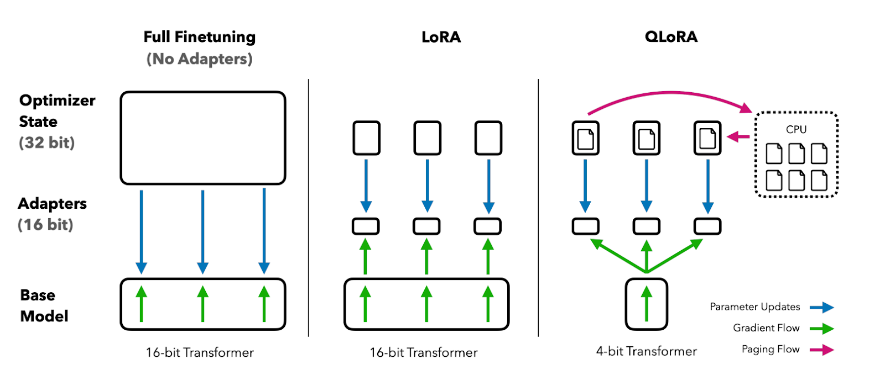

# Whazzat

✅ The backend is in nodejs, to make it easier to deploy in Firebase functions.

✅ [Axesso - Amazon Data Service API Documentation (axesso) | RapidAPI] (https://rapidapi.com/axesso/api/axesso-amazon-data-service1/) is used to fetch products from Amazon. Although it is a bit slow (API response time is around 4s), but we are getting good output. We are planning to implement a caching mechanism to handle the slowness.

✅ API definition 
```bash
$ curl -X POST https://productsearchapi-vdvgfog7kq-uc.a.run.app/api/v1/search/product
   -H 'Content-Type: application/json'
   -d '{"search_prompt": "abc"}'
```
```bash
# Response:
{
    "status": "Success",
    "success": true,
    "data": [{
        "productDescription": "YC Modern 10-Pieces Dinner Forks, Stainless Steel Flatware Dinner Forks (#1 Forks)",
        "asin": "B078MQQVQ1",
        "countReview": 325,
        "imgUrl": "https://m.media-amazon.com/images/I/71PyQ+VMJzL._AC_UL320_.jpg",
        "price": 6,
        "retailPrice": 15.9,
        "productRating": 4.4,
        "prime": false,
        "dpUrl": "https://amazon.ca/YC-Modern-10-Pieces-Stainless-Flatware/dp/B078MQQVQ1/ref=sr_1_6?keywords=Fork&qid=1700527298&sr=8-6",
        "series": null,
        "deliveryMessage": "$9.80 delivery Dec 1 - 15 ",
        "variations": []
    }] # limited for 50 data points
}
```
✅ Appsmith to host our frontend https://app.appsmith.com/app/whazzat/home-6556f707c8bcd467b929daa4 

✅ fine_tune_llama2.ipynb is our initial Llama2 model that we are using in google colab. QLora based peft (parameter efficient fine tuning) is used to be able to run and finetune the Llama2 model in google colab's free edition. If it does not go as plan we will use paid edition.



✅ evaluation.py is the script that validates the Llama2 output with gpt4.

